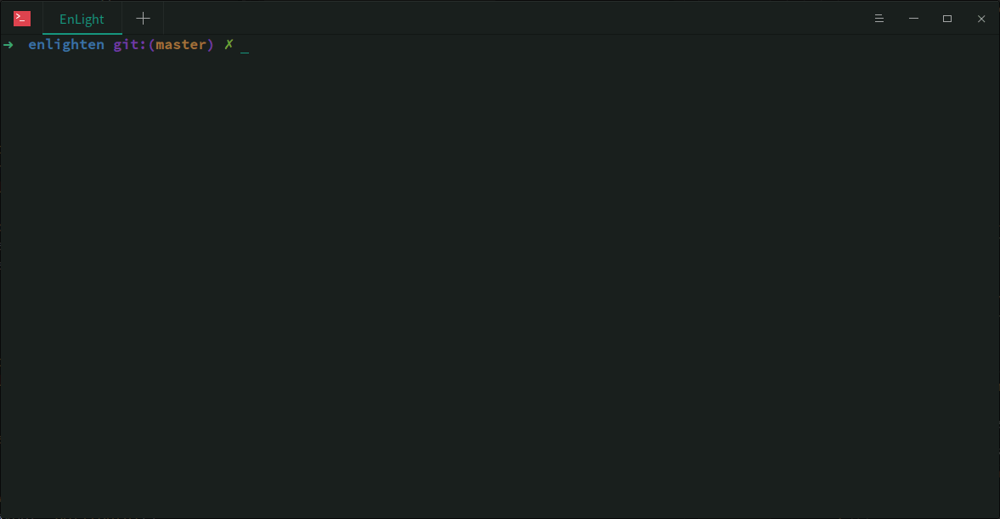

# enlighten
用于古诗文浏览和背诵的终端APP

Power By [Cursive](https://github.com/gyscos/cursive)

感谢 [中华古诗文数据库](https://github.com/caoxingyu/chinese-gushiwen) 提供的API!

## 安装

```bash
cargo install --git https://github.com/PrivateRookie/enlighten.git

enlighten
```



